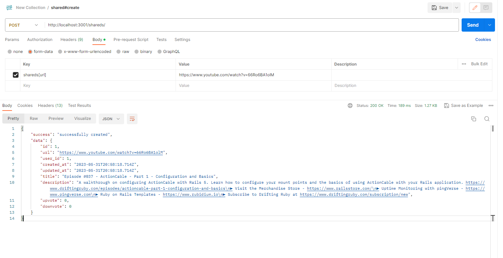

# Youtube Video Sharing

## Introduction: A brief overview of the project, its purpose, and key features.
Youtube Video Sharing is an online platform that allows user to share and react youtube video via the link. The main purpose of the project is to to provide a space for community to discover, and share insteresting video content on the Youtube.   


Key Features: 
- Share videos: Users can share their videos through links of Yoututbe. This helps users reach a large audience and get more react about this video. (future feature: get feedback about video)
- Get notifications about new videos shared: Quickly receive the latest videos on YouTube that are of interest to a wider audience.
## Prerequisites: List required software and tools, along with their appropriate versions.
To develop this application, we will need the following software and tools with their respective versions:

- Ruby: Version 3.2.2

Ruby is the programming language used in the Rails framework.
- Rails: Version 7.0.5

Rails is the web application framework used for building the application.
- Node.js: Version 16.17.0

Node.js is a JavaScript runtime used for building the Next.js 12 framework.
- Next.js: Version 12

Next.js is a React framework for building server-rendered applications. It is used in combination with Node.js.
- PostgreSQL

PostgreSQL is a powerful, open-source relational database management system used for storing application data.
- Redis

Redis is an open-source, in-memory data structure store used as a database, cache, and message broker.


## Installation & Configuration: Step-by-step instructions for cloning the repository, installing dependencies, and configuring settings.
The first of all, we must installed above software and tools.
1. Cloning the repository
- Clone Rails app
```bash
git clone git@github.com:phamvmnhut/youtube-video-sharing-backend.git
```
- Clone nextjs app inside rails app and rename it to frontend
```bash
cd youtube-video-sharing-backend
git clone git@github.com:phamvmnhut/youtube-video-sharing-frontend.git frontend
```
2. Installing dependencies
- Install dependencies in Rails app   
In workpace and run
```bash
bundle install
```
- Install dependencies in Nextjs app   
In frontend folder and run
```bash
yarn install
```
3. Configuring settings
- Setup database for Rails app   
Set below evironment corresponding to your postgresql database
```
DATABASE_USERNAME = 
DATABASE_PASSWORD = 
```
- Setup api for Nextjs app   
Because Rails app will run in port 3000
```
NEXT_PUBLIC_BACKEND_API_URL = http://localhost:3000
NEXT_PUBLIC_BACKEND_WS = ws://localhost:3000/cable
```
- Setup youtube data v3 key   
Because this project will interact with youtube api to get video information, we must have a key of youtube api. ( Step-by-step instructions can be found in the detailed guide provided here: https://blog.hubspot.com/website/how-to-get-youtube-api-key)
And then set it into environemnt
```
YOUTUBE_API_KEY = <your-youtube-api-key>
```
- Setup secket key for JWT for authenticate user
```
SECRET_KEY_BASE = <your-secret-key>
```
## Database Setup: Instructions for setting up the database, running migrations, and seeding data if necessary.
- Create new database for developemnt and test evironment
```bash
bundle exec rails db:create
```
- Migrate database structure
```bash
bundle exec rails db:migrate
```
## Running the Application: How to start the development server, access the application in a web browser, and run the test suite.
1. Run developemtn server
- Run rails app   
In workspace and run
```
rails s
```
- Run background job   
Open new terminal in workspace and run
```
bundle exec sidekiq
```
- Run Nextjs app
Move to frontend folder and run
```
yarn dev
```
2. Access the application in a web browser
- Open your browser in http://localhost:8080
3. Run test
```
rspec
```
## (BE/FS) Docker Deployment: Instructions for deploying the application using Docker, including building the Docker image and running containers (optional for Backend developer)
| Current guide is for reference only. Because it contains some bugs.

- Create a new file for env named .env and setup some information
```
YOUTUBE_API_KEY = <your-youtube-api-key>
```
- Edit some information in docker-compose for your purpose:   
  + Setup some export port for service such as nextjs, nginx, or rails   
  + Setup some evironment for postgresql database: url, password, username   
  + Setup SECRET_KEY_BASE   


- Edit nginx.config   
| <strong>Current bug in here</strong>
- Run build docker-compose
```
docker-compose build
```
- Run project
```
docker-compose up -d
```

## Usage: A brief guide outlining how to use the application, including any specific features or functionality the reviewer should be aware of.
- Register and login user   
  + On right corner, we have a button for register/login. It will show a modal. We can switch to register and login in this.   
  + After we loged in, we will be able to receive the new video shared notification as the top-right corner popup.  
  + In this popup, we can click on refresh button to fresher our data on homepage.   
## Troubleshooting: Common issues that may arise during setup and their potential solutions.
- I have more issues when start with this project, because it is the first time I learn and run with Ruby, Rails technology.
- Currently, I have a bug in deploy project by docker, docker-compose. I had built and run all image successful, but it can't work together. I think it is because Nginx can't reach to rails service. I am will try do best to fix this bug ASAP. 

## Image demo and runing some services
- Docker running


- Enqueued job


- Ferform queue


- Can get information video


- Register and login screen


- Have a video shared


- Have a notification


